# Learning React - nactive

I managed to make my first apps in react-native, following the Hitesh [Choudhary](https://www.youtube.com/@HiteshChoudharydotcom) course sponsored by [hashnode](https://hashnode.com/), it's really good [React Native Mastery with 10 apps](https://www.youtube.com/playlist?list=PLRAV69dS1uWSjBBJ-egNNOd4mdblt1P4c)

# 10 apps

|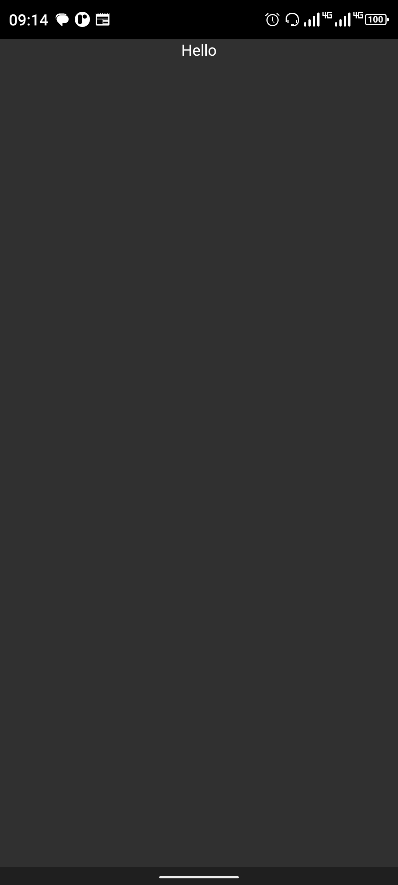[Awesome 01](./Awesome01/) | 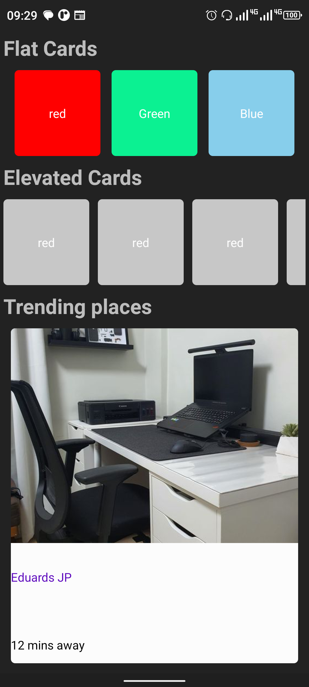[LayoutClone](./layoutcard/) | 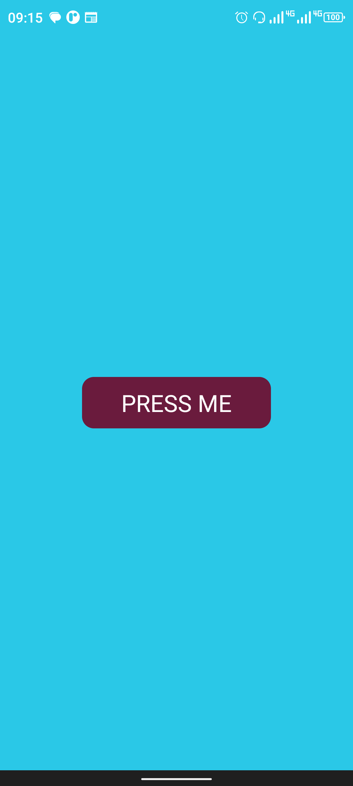[BackGround color change](./bgChaanger/) | 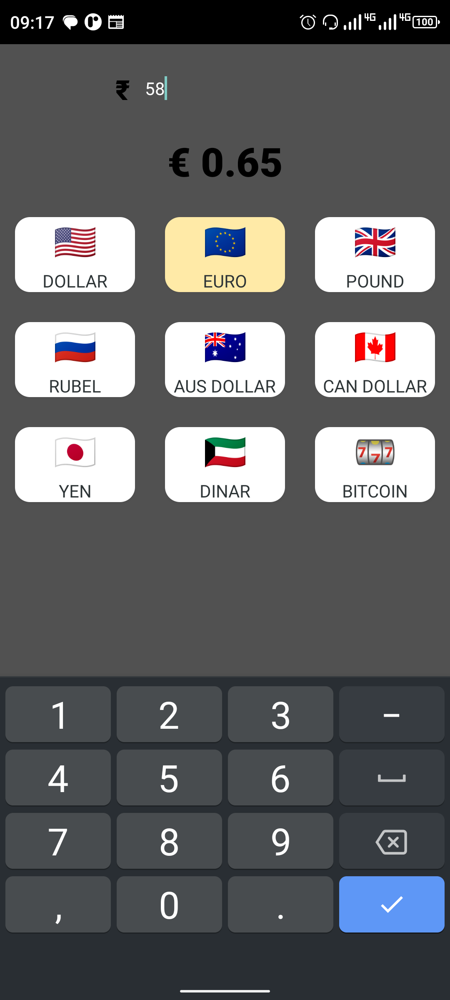[Converter Currency](./currencyconverter/) |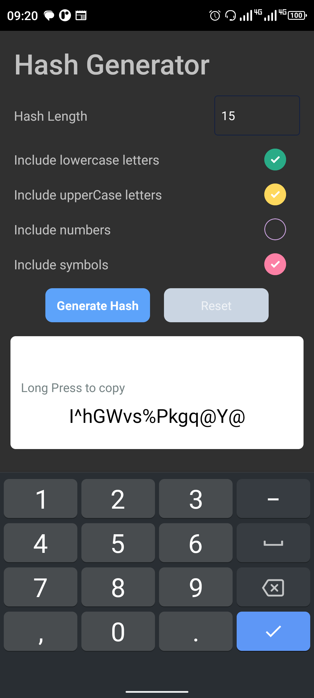[Generate Password](./generateHash/)|
|:--:|:---:|:---:|:---:|:--:|

| 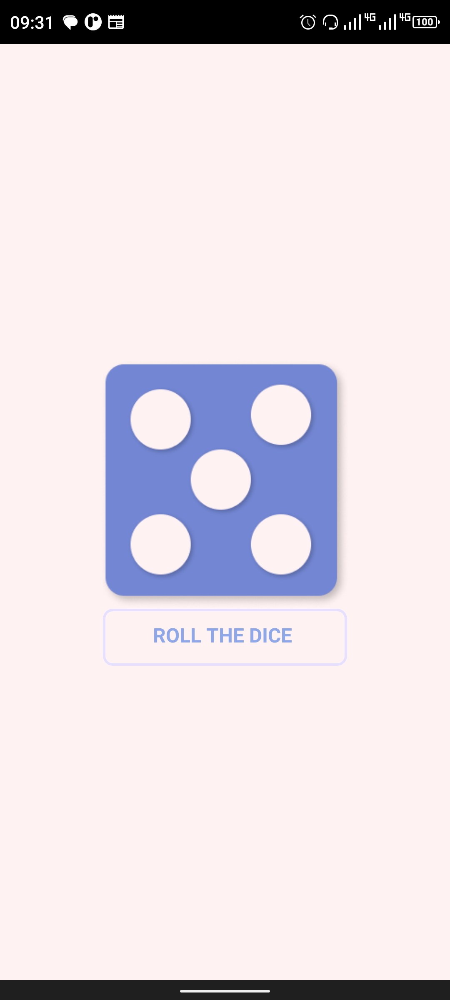[Roll the Dice](./rollthedice/) | 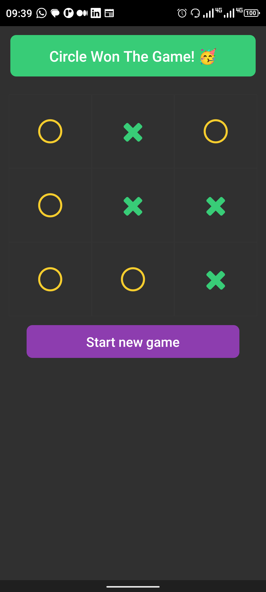[Tic Tac Toe](./tictactoe/)| 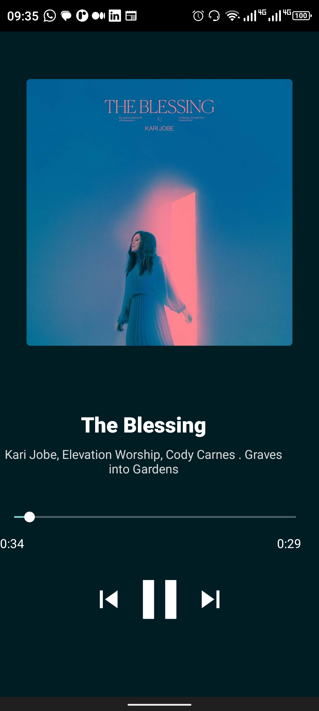[SpotifyClone](./spotifyClone/) | 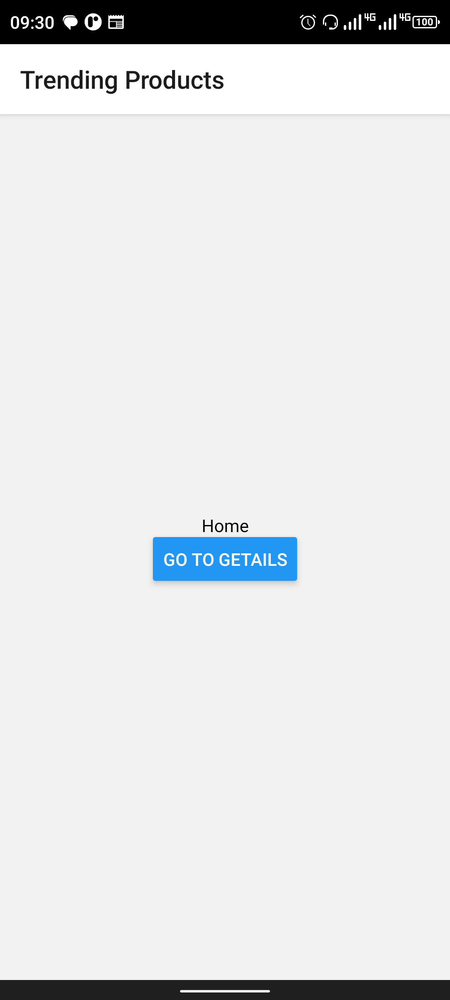[Navigation explore](./navigationexplare/) | 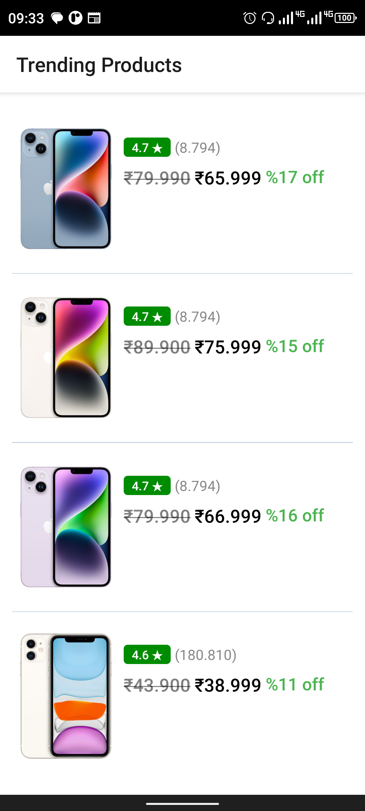 [Shopping](./shopping10/)|
|:---:|:--:|:--:|:--:|:--:|

- The following apps have been made and will be made, based on everything I learned, research, reading and lots of codes...
- 
| 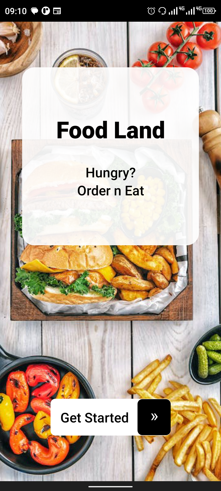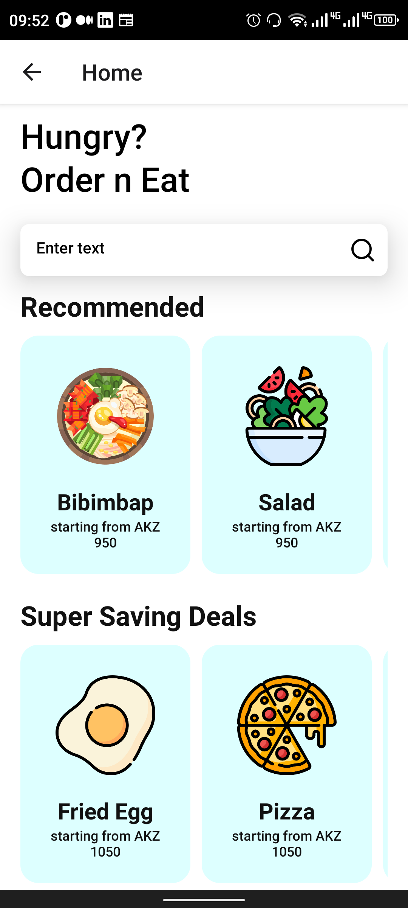   [foodland](./foodland/)|
|:--:|
