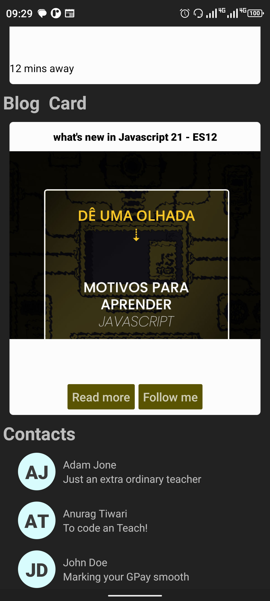
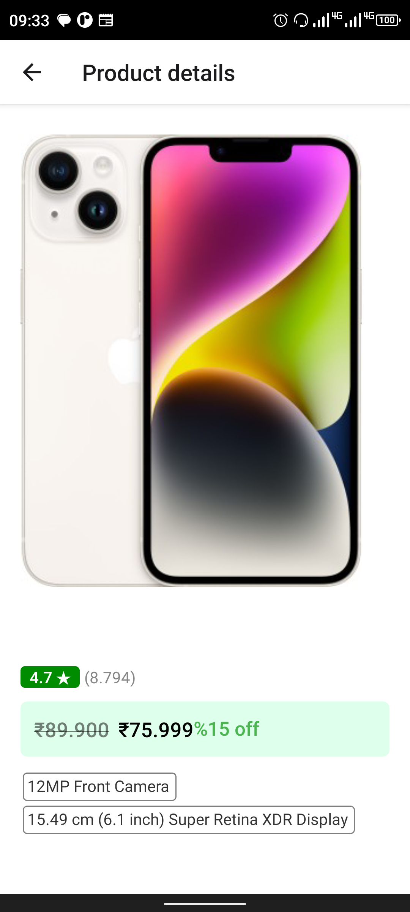

# Learning React - nactive

I am learning react-nactive with hetech, you can learn it too free on [link].

In this series, we ara making many apps

## Apps

- Awesome 01

  

- LayoutClone

  
  

- BackGround color change

  

- Converter Currency
  

  

- Generate Password

  

- Roll the Dice

  

- Tic Tac Toe

  

- SpotifyClone

  

- Navigation explore

  

- Shopping

  
  

- made for me:
- foodland

  
  

